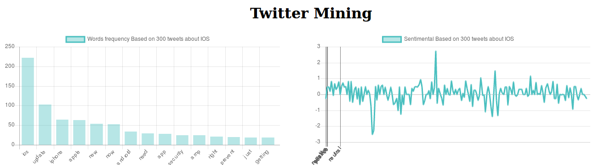
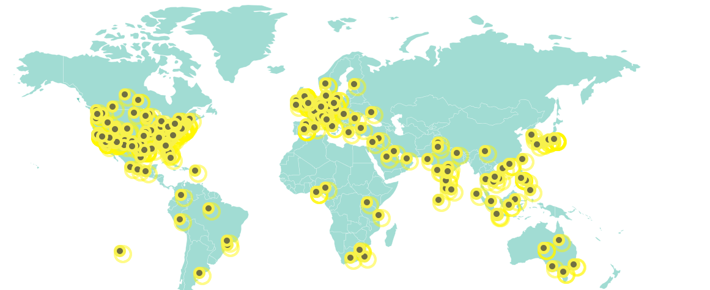

# TwitterMining
This project is a very simple Mining of twitter data with ruby , Text Pre-processing to gather Term Frequencies, Simple Sentiment Analysis and tweets Geolocation.


Quick guide
-----------
* Install

clone it or fork it

```
git clone git@github.com:bechirsegni/TwitterMining.git
# Don't forget'
bundle install
```

Create a simple twitter app and create a file inside config twitter.yml
a simple version is inside the same folder twitter-auth.yml

```
Twitter:
  consumer_key:
  consumer_secret:
  access_token:
  access_token_secret:
```

* Use it

go ahead to init.rb and change the values in the search function and run

```
ruby init.rb
```
The output should be located at Data Folder in json format or you can use simple API for you data

```
# Accessible via http://localhost:4567
ruby api.rb
```
Endpoints:
  - /:filename will open the full json Data
  - /f/:filename will open the frequency Data

  Visualize Data on Map Chart
  -----------

Simply change the json file Inside the web/map folder and the path inside map.js



```
var markers = [];
  $.getJSON("apple.json", function(json) {
  $.each(json, function(k, v) {
  markers.push({
            "zoomLevel": 5,
            "scale": 0.5,
            "title": v.text,
            "latitude":  v.lat,
            "longitude": v.lng,
          });
});});

```
